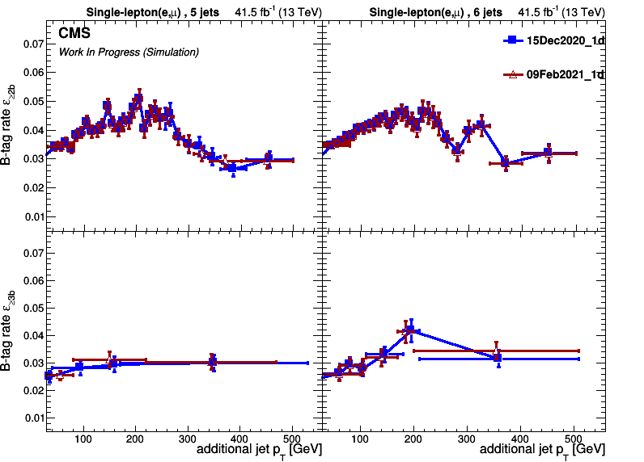

# Obtaining a Data-Driven Estimate Using TRF-mathod

 Take hadded files from step1 or step2 and run through events and jets; which allows to select and split jets in subgroups
 which are used to obtain the TRF.
 
 ## Production Steps:
   * [`analyze_trueTopRem.py`](https://github.com/NikHoffStyl/singleLepAnalyzer/blob/fourtops/TTJetsTRFstudy/analyze_trueTopRem.py) is used to produce histograms in the ideal case (i.e. only in MC where we have truth info)
      * Run for all processes (or at least all TTJets) using [`doHists.py`](https://github.com/NikHoffStyl/singleLepAnalyzer/blob/fourtops/TTJetsTRFstudy/doHists.py) locally
        * You check out what arguments are available using `--help` or `-h`
        * Example for Running: ```python -u doHists.py <outputDir> --year=2017 -vv ```
      * Submit Job example for J5 and J6 (which is the TRF extraction region):
      * ```markdown
        for jj in 5  6; do for bb in 2p 3p;do outDir=<outDirName>/${jj} ; qsub -q localgrid -N <jobName> -o <outDir/jobName>.out -e <outDir/jobName>.err -v INDIR=${PWD}/${outDir},iPLOT=${iplot},REGION=extractionProdAna_<moreTexT>,nBTAG=${bb},nJETS=${jj} doQSUBjob.sh;done;done;
        ``` 
      * N.B. `doHists` knows if you are runing a job or are local 
        (**Currently only if job runs in directory called /scratch**) 
   * [`doTemplates_TRFversion.py`](https://github.com/NikHoffStyl/singleLepAnalyzer/blob/fourtops/TTJetsTRFstudy/doTemplates_TRFversion.py) is used group processes and scale ttbb and tt-other 
      * To Run do:
      * ```markdown
        python doTemplates_TRFversion.py R17 <pathToPickleFiles>/el20mu20_MET60_MT60_1jet0_2jet00/
        ```
   * [`plotTemplates_TRFversion.py`](https://github.com/NikHoffStyl/singleLepAnalyzer/blob/fourtops/TTJetsTRFstudy/plotTemplates_TRFversion.py) is used to save plots in `.pngs` 
      * To Run do:
      * ```markdown
        python  plotTemplates_TRFversion.py <pathToRootFile>/el20mu20_MET60_MT60_1jet0_2jet00/ <btag> <nJets> <statPercent> <WhichHistToBaseRebin/in/out>
        ```
   * [`plotallTRFs.py`](https://github.com/NikHoffStyl/singleLepAnalyzer/blob/fourtops/TTJetsTRFstudy/plotallTRFs.py)  is used as an odd(to-fix-later) way to plot various TRFs on the same plot
     * To Run do:
     * ```markdown
        python3 plotallTRFs.py --list2b  <pathTo1stFile>/MCeff_J6_B2p_isL0p1.txt <pathTo2ndtFile>/MCeff_J6_B2p_isL0p1.txt <pathTo3rdFile>/MCeff_J6_B2p_isL0p1.txt 
                               --leglist <legendEntry1> <legendEntry2> <legendEntry3> --fout _exampleKey --indir <DirectoryUsedToSaveOutput>
       ```
     * Example Picture: \
       
       
       
## Implementation Steps
 * [`analyze_trueTopRem_Implement.py`](https://github.com/NikHoffStyl/singleLepAnalyzer/blob/fourtops/TTJetsTRFstudy/analyze_trueTopRem_Implement.py) is used to produce histograms in the ideal case. It saves the same histograms as 
 in production and the necessary plots weighted additionally by the event weight produced by the TRF.
    * Run same way as before but need to use an argument `-doI` or `--doImplementation`
    * Eaxmple: ``` python -u doHists.py <outputDir> --year=2017 -doI -v```
    * Additionally note that you will need a JSON file like `eff_b2p.json`
    
 * [`doTemplates_TTJetsImplement.py`](https://github.com/NikHoffStyl/singleLepAnalyzer/blob/fourtops/TTJetsTRFstudy) used to group processes like before and scale ttbb and tt-other
    * To Run its the the same as for `plotTemplates_TRFversion.py` 
 
 * [`plotTemplates_CompareEstimate.py`](https://github.com/NikHoffStyl/singleLepAnalyzer/blob/fourtops/TTJetsTRFstudy/plotTemplate_CompareEstimates.py)  is a simple plotter for 
 
 
## Side comments:
  * The scripts in this directory or imported from the previous directory are mostly compatible as-is to be used for 
  python releases 2.7 to 3.6(+) ; and it has been roughly tested a few root releases , where the latest working test was 6.20.00 ROOT release
  (also would like to note: [conda-forge](https://github.com/conda-forge/root-feedstock/blob/master/README.md) nice easy root install in environments).
    * However, note that pickle between releases is currently not supported (at least not for ROOT classes);
    * also note that you will have to follow some simple [idioms](https://python-future.org/compatible_idioms.html) ; 
    that is to say if they are not already in place or you need to add code.
    * N.B. Having compatibility between releases is a continiuous  working progress.
  * The plan was(/is) to make this set of scripts easy to run by simply editting a configuration file such as a json or yaml;
   and have flexibility with command-line arguments; such as the user does not need to edit all these scripts and debug before running.
   Unfortunatelly, if the user wants to add new output histograms coming from analyze step, then this may require a little more effort by the user. 